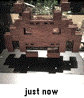

phantom-camera
==============

Take a picture with your Pebble watch!  Well, actually, let other people take pictures for you via Instagram.

This only works on color devices, as I didn't want to try to convert images to b/w for Aplite.

As of version 2.4, this supports the Chalk (Pebble Time Round) platform as well.  Pictures are shown centered and cropped to the edges.

Licensed under the MIT License, see LICENSE for details.

